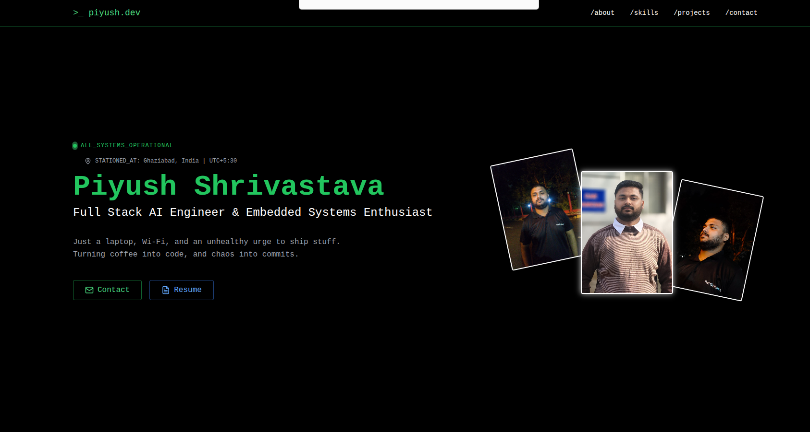

# Engineer's Portfolio

Hi there, I'm an Electronics and Communication Engineering Student (Batch of 2026) and Full-Stack Developer with my experince in creating dynamic frontend and building scalable backend architecture. 

### Tech Stack -

* **React 19:** Component-driven UI architecture.
* **Tailwind CSS:** Utility-first styling for a fully responsive, mobile-first layout.
* **Framer Motion:** Smooth, scroll-triggered animations.
* **Web3Forms:** Serverless email integration for a secure, functional form to write-me.
* **Lucide React:** Clean, consistent and minimalist icons.

### Key Features -

* **UI Theme:** A developer-centric UI focusing on readability, dark mode, and high contrast.
* **Interactive Animations:** Polished scroll-reveal and layout transitions that enhance user engagement without sacrificing speed.
* **Functional Contact System:** A fully working, client-side validated contact form without requiring a dedicated custom backend.
* **Performance Optimized:** Built for fast load times and seamless responsiveness across all device breakpoints.

### Developed By -

**Piyush Shrivastava**
* Full Stack Developer
* [Portfolio](https://portfolio-v1-iota-gray.vercel.app/)
* [Linkedin](https://www.linkedin.com/in/piyush-shrivastava-58351825b/)